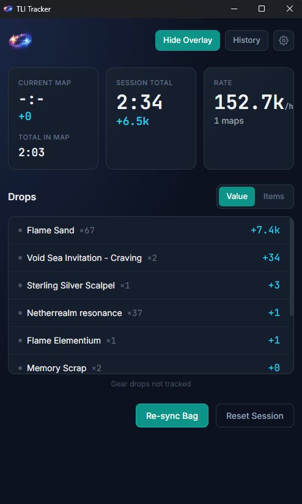
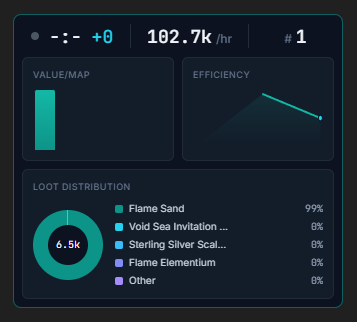

# TLI Tracker

🚨 ALERT 🚨 idk if tos 🚨 gl 👍

A real-time drop tracker and overlay for tli that monitors ur loot and displays farm stats

<table>
  <tr>
    <td></td>
    <td></td>
  </tr>
  <tr>
    <td align="center"><em>dw about the flame sand FE value</em></td>
    <td align="center"><em>Overlay</em></td>
  </tr>
</table>

also this is an unsigned app
if u trust me u install via .exe provided in releases tab and exclude root install folder in windows defender to bypass warnings, if u don't i hope ur not scared of snakes 🐍
cuz u'll have to run the app urself via python in order for windows to stop complaining

## Installation

### Requirements

1. Be on Windows
2. Also ur game should be in English
   - pretty sure that decides in which language the game logs r saved, if not idk
   - basically this thing won't work with any other language.. yet

### Option 1: Setup.exe

1. Download the latest release from the releases page
2. Left click (two times) `TLITracker_Setup.exe`

### Option 2: From Source

If ur looking at this section u could've probably made this urself but here:
1. Clone the repo
2. Install Python 3.11 or higher
3. Install dependencies:
   ```bash
   pip install -r requirements.txt
   ```
4. Run the app:
   ```bash
   python -m app.main
   ```

## Features

- **Real-time Drop Tracking** - Automatically detects and tracks item drops by monitoring game logs generated by the user
- **Market Value** - Can show the value of your drops based on current market prices
- **In-Game Overlay** - Transparent overlay that displays session stats while you play
- **Session Management** - Tracks multiple farming sessions with stats and history
- **CSV Export** - Export session data to CSV for external analysis (one row per drop)

## Usage

1. **Launch the App** - Start TLI Tracker, read the words on the screen

2. **Configure Log Path** - On first run, the app will attempt to locate ur game logs automatically. If it doesn't, good luck I haven't gotten there yet.

3. **Start Farming** - The app automatically detects when u enter and exit maps

4. **Stats** - Stats shown:
   - Current session value (session is started when u first enter a map)
   - Map run count (during session)
   - FE per hour (if any)
   - Summed drop list (during session)

5. **Manage Sessions** - Create new and view past sessions

## Configuration

Settings can be adjusted through the overlay UI or by editing `data/config.json`:

## How It Works

1. Watches the Torchlight Infinite game log file for changes
2. Parses log entries to detect:
   - Map entry/exit events
   - Item drops (bag modifications)
   - Price data from in-game searches
      - all price data is stored locally on ur machine
      - updates only when u "price-check" the item from ur bag in-game
      - if u see "(no price)" on the app the item's value is considered to be 0 for the purpose of calcs .. just price check the item or ignore
3. Looks up prices u saved and calculates total values for the dropped items during a session

## Thanks

- Torchlight Infinite community database (https://tlidb.com/) for item names and ids
- Anthropic, Opus and Claude Code
