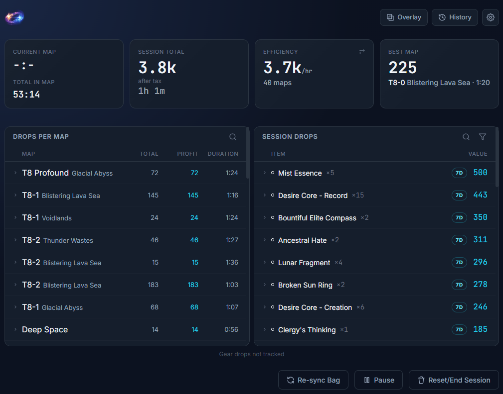
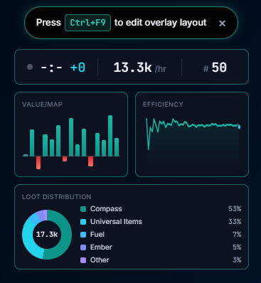
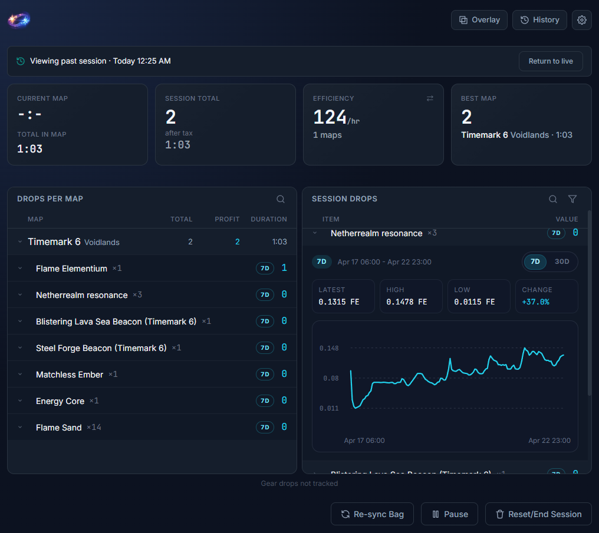
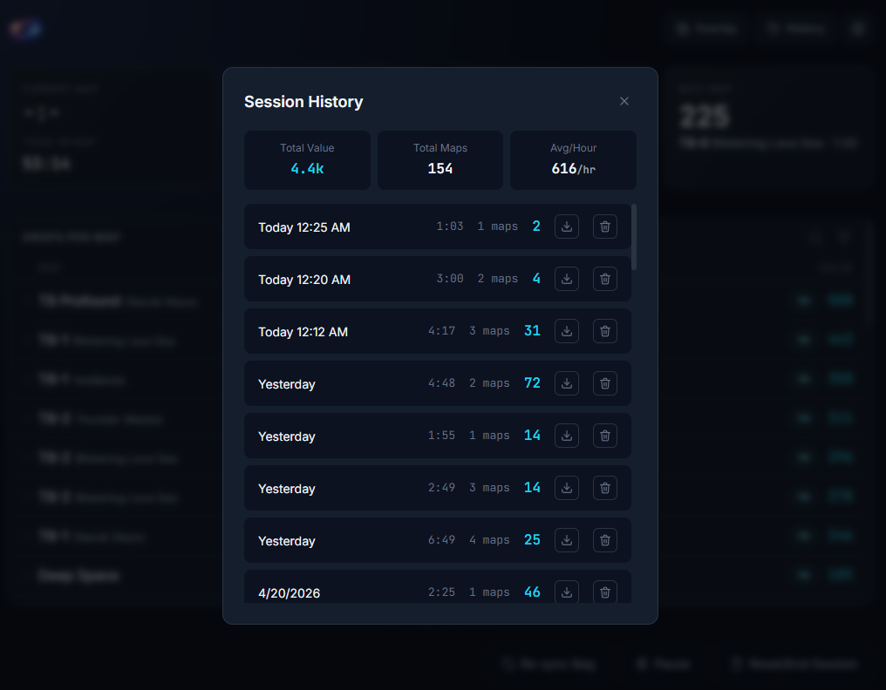

# TLI Tracker

A real-time drop tracker and overlay for tli that monitors ur loot and displays farm stats

This app doesn't read or write any game releated data outside of ur machine. Unless u enable cloud pricing.

<table>
  <tr>
    <td></td>
    <td align="center" valign="middle"></td>
  </tr>
  <tr>
    <td></td>
    <td align="center" valign="middle"></td>
  </tr>
  <tr>
    <td align="center"><em>Main Window & Session Viewer</em></td>
    <td align="center"><em>Customizable Overlay & Session History</em></td>
  </tr>
</table>

also this is an unsigned app
if u trust me u install via .exe provided in releases tab and exclude root install folder in windows defender to bypass warnings, if u don't i hope ur not scared of snakes 🐍
cuz u'll have to run the app urself via python in order for windows to stop complaining

> also not ToS (very likely)
> 
> also not affiliated with or endorsed by XD Inc

## Installation

### Requirements

1. Be on Windows
2. Also ur game should be in English

### Option 1: Setup.exe

1. Download the latest release from the releases page
2. Left click `TLITracker_Setup.exe`  (two times)

### Option 2: From Source

1. Clone the repo
2. Install Python 3.11 or higher
3. Install dependencies:
   ```bash
   pip install -r requirements.txt
   ```
4. Run the app:
   ```bash
   python -m app.main
   ```

## Features

- **Real-time Drop Tracking** - Automatically detects and tracks item drops by monitoring game logs generated by the user
- **Market Value** - Can show the value of your drops based on current market prices
- **In-Game Overlay** - Transparent overlay that displays session stats while you play
- **Session Management** - Tracks multiple farming sessions with stats and history
- **CSV Export** - Export session data to CSV for external analysis

## Usage

1. **Launch the App** - Start TLI Tracker, read the words on the screen

2. **Configure Log Path** - On first run, the app will attempt to locate ur game logs automatically. If it doesn't, you can set the custom log path in the app settings.

3. **Start Farming** - The app automatically detects when u enter and exit maps or pick up items

4. **Stats** - Stats shown:
   - Current session value (session is started when u first enter a map)
   - Map run count (during session)
   - FE per hour (if any) or per map (based on user settings)
   - Summed drop list (during session)

5. **Manage Sessions** - Create new and view/export past sessions

## How It Works

0. Enable game logs in the game settings and sort the bag ingame to start tracking
1. Watches the Torchlight Infinite game log file for changes
2. Parses log entries to detect:
   - Map entry/exit events (this is when the session timer starts)
   - Item drops (bag modifications)
   - Price data from in-game searches
      - all price data is stored locally on ur machine
      - updates only when u "price-check" the item from ur bag in-game, or at set intervals if you enable cloud pricing
      - if u see "(no price)" on the app the item's value is considered to be 0 for the purpose of calcs, just price check the item or ignore
3. Looks up prices u saved and calculates total values for the dropped items during a session
4. When you are done Reset/End session button stops and saves the current session

## Thanks

- Torchlight Infinite community database (https://tlidb.com/) for item names and ids
- Anthropic, Opus and Claude Code
